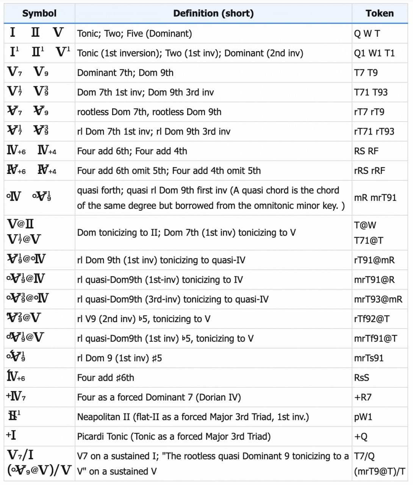
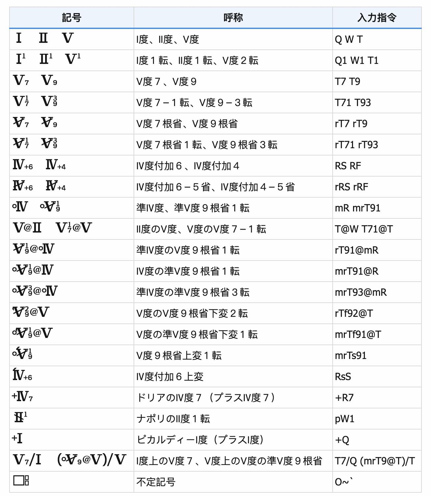

# Yuzuri-Font

A typeface which allows easy typography of Shimaoka Roman Numerals used among conservatories in Japan. Especially useful for remote harmoniology lessons during the pandemic.

> 「ゆずり」という島岡系芸大和声記号専用フォントです。**このフォントのおかげで、古典和声の遠隔通信授業の時に Dorico / MuseScore / Sibelius / Finale / LilyPond などの採譜ソフトの画面共有だけで講義できます。**// 手書きしてビデオ撮りながらの通信授業は大変すぎて面倒ですね。

The name of the font "Yuzuri" (pronounces “Yuzuli” in English) is a derivative feminine name from Yuzuru Shimaoka's first name. (Yuzuru sounds male, Yuzuri sounds female.)

> このフォントの名前「ゆずり」は、島岡譲氏の下の名前「ゆずる」を女性化してからの名前です。「柚莉」は中国語での名前です。

Notice:

* The "@" indicates which key to tonicize. Supposing that you want to use the IV-V progression to tonicize the V, you write "(IV-V)@V".
* Similarly, when you want to indicate a sustained bass note (e.g. V), the approach is similar to pop music: (Chord or Chord Progression) / V. Shimaoka harmoniology uses roman numerals to indicate not only chords but also pitches.

The two notices above are describing differently than what Shimaoka did in his books, but **these changes help almost anyone to use a computer to type the chord symbols**.

> 尚：
> 
> * 「＠」は「IVのV」のような副次固有和音を使うときに、副次調（トニック化の対象となる調）「V」を示すための記号である。「〔I - V - I のような和音進行〕＠ 副次調」も可です。
> * 「X度上の〇〇」のような保続低音を示すときに「和音記号／保続低音」「〔I - V - I のような和音進行〕／保続低音」のようにご入力ください。
> 
> これは《総合和声：実技・分析・原理》《和声：理論と実習》《XXの仕組み、XXの仕組み、XXXXのために》の記号と少し違いますが、情報機器で誰も入力しやすければいいと思った故です。

小文字と大文字の機能はそれぞれなのでご注意ください。(Pay attention to lower and upper cases due to their different functions.)

| 入力文字 Input Character 	| 対応和声記号 Corresponded chord symbol                                                          	|
|----------	|------------------------------------------------------------------------------------	|
| O | 何れの音階・和声 // Wildcard symbol indicating current chord degree |
| ZXCVBNM | 音階とその音を示す記号 // Indicating Scales and Tones
| Q        	| I                                                                                  	|
| W        	| II                                                                                 	|
| E        	| III                                                                                	|
| R        	| IV                                                                                 	|
| T        	| V                                                                                  	|
| Y        	| VI                                                                                 	|
| U        	| VII  (実に稀です。島岡系芸大和声では減和声と導７和声はすべて属和音の根音省略形と呼ばれる。// Extremely rarely used. All diminished chords are described as rootless dominants in Shimaoka Harmoniology.)           	|
| F        	| 付加4 // Add 4th                                                                	|
| S        	| 付加6 // Add 6th                                                                   	|
| f        	| 第5音の下変（ローマ数字の直後に置くこと） // ♭5 (typed right after the Roman Numeral)                  	|
| s        	| 第5音の上変（ローマ数字の直後に置くこと）// ♯5 for Dominants, ♯6 for subdominants                	|
| m        	| 同主短調から借用した準固有和音 // The diatonic chord of the same degree borrowed from omnitonic minor.        	|
| +        	| 長和音と強調する記号 // Enforce a major chord. 	|
| -        	| 短和音と強調する記号 // Enforce a minor chord. 	|
| r        	| 根音省略形あるいは第５音省略形（ローマ数字の直前に入力すること） // Rootless Dominant or 5thless Subdominant (typed right before the Roman Numeral)    	|
| p        	| ナポリのII度  // Neopolitan II                                                                     	|
| 1 2 3 4 \` | 第？転回形  // Which inversion                                                    	|
| 7 9 ~ 	| ７和音と９和音（転回形の直前に入力すること）// 7th or 9th chords (typed right before the inversion number)      	|
| @        	| 副次調指定記号 // Tonicization target indicator   	|
| /        	| 保続低音指定記号 // Sustained bass note indicator       	|
| () [] {} 	| 括弧   // Brackets             	|

